# Hi there, I'm Neeraj Nambiar 👋

<div align="center">


[](https://www.linkedin.com/)
[](https://www.upwork.com/)
[](mailto:yourname@email.com)
[](https://yourportfolio.com)


</div>

---

## 👨‍💻 About Me

```javascript
const neeraj = {
    location: "Surat, Gujarat, India 🇮🇳",
    role: "Backend Developer & Automation Specialist",
    company: "Freelancer @ Upwork",
    code: ["JavaScript", "TypeScript", "Python", "SQL"],
    technologies: {
        backend: ["Node.js", "Express.js", "REST APIs", "GraphQL"],
        databases: ["MongoDB", "PostgreSQL", "MySQL", "Redis"],
        automation: ["Zapier", "Make", "n8n", "Webhooks"],
        devOps: ["AWS", "Docker", "Nginx", "Linux", "PM2"],
        tools: ["Git", "Postman", "VS Code", "Jira"]
    },
    architecture: ["Microservices", "Event-Driven", "Serverless"],
    currentFocus: "Building scalable APIs & intelligent automation workflows",
    funFact: "I automate everything... even my coffee maker ☕"
};
```

🚀 **What I Do**: I build production-grade backend systems and create intelligent automation workflows that eliminate manual work, improve reliability, and help businesses scale efficiently.

💡 **Specialization**: API Development, Database Design, Workflow Automation, System Integration, and Cloud Infrastructure.

🎯 **Mission**: Automate the boring stuff, build the extraordinary!

---

## 🛠️ Tech Stack

### Languages


### Backend & APIs


### Databases


### Automation & Integration


### Cloud & DevOps


### Tools & Platforms


---

## 📊 GitHub Statistics

<div align="center">


</div>

<div align="center">


</div>

<div align="center">


</div>

---

## 🏆 GitHub Trophies

<div align="center">


</div>

---

## 🎯 What I'm Currently Working On

```mermaid
graph TD
    A[🔧 Production APIs] --> B[JWT Authentication]
    A --> C[Rate Limiting & Security]
    A --> D[API Documentation]
    
    E[🤖 Automation Workflows] --> F[CRM Integration]
    E --> G[AI-Powered Processes]
    E --> H[Email Automation]
    
    I[☁️ Cloud Infrastructure] --> J[AWS Setup]
    I --> K[Docker Containers]
    I --> L[CI/CD Pipelines]
    
    M[📊 Database Optimization] --> N[Query Performance]
    M --> O[Schema Design]
    M --> P[Caching Strategies]
```



- 🔧 **Backend Development**: Building scalable RESTful APIs with Node.js & Express
- 🔐 **Security Implementation**: JWT authentication, OAuth 2.0, and API security best practices
- 🤖 **Intelligent Automation**: Creating AI-powered workflows using n8n and Make.com
- 📊 **Database Optimization**: Improving query performance and designing efficient schemas
- ☁️ **AWS Infrastructure**: Managing EC2, S3, RDS, and deploying production applications
- 🔄 **System Integration**: Connecting multiple platforms via APIs and webhooks
- 📝 **Technical Documentation**: Writing comprehensive API docs and developer guides

---

## 💼 Services I Offer

<table>
<tr>
<td width="50%">

### 🔧 Backend Development
- ✅ RESTful API Development
- ✅ GraphQL API Implementation
- ✅ Database Design & Optimization
- ✅ JWT/OAuth Authentication
- ✅ Real-time Features (WebSockets)
- ✅ Payment Gateway Integration
- ✅ Third-Party API Integration
- ✅ Microservices Architecture

</td>
<td width="50%">

### 🤖 Automation Solutions
- ✅ Zapier Workflow Creation
- ✅ Make.com Automation Scenarios
- ✅ n8n Custom Workflows
- ✅ CRM & Marketing Automation
- ✅ Email & SMS Automation
- ✅ Data Migration Scripts
- ✅ Webhook Implementation
- ✅ Scheduled Task Automation

</td>
</tr>
</table>

---

## 🚀 Featured Projects

<div align="center">

<a href="https://github.com/neerajnambiar/project1">
  
</a>
<a href="https://github.com/neerajnambiar/project2">
  
</a>

</div>

### 🔹 Enterprise CRM Integration Suite
**Tech Stack**: Node.js, MongoDB, Zapier, REST APIs, AWS  
**Description**: Automated workflow connecting 5+ tools (CRM, Email, SMS, Analytics) saving 120+ hours/month  
**Impact**: 95% reduction in manual data entry, 99.8% accuracy  
⭐ [View Project](#) | 🔗 [Live Demo](#)

### 🔹 Multi-Tenant SaaS Backend
**Tech Stack**: Express.js, PostgreSQL, Redis, JWT, AWS EC2  
**Description**: Scalable API serving 10,000+ users with role-based access control  
**Performance**: <100ms response time, 99.9% uptime, handles 1M+ requests/day  
⭐ [View Project](#) | 🔗 [Live Demo](#)

### 🔹 AI-Powered Automation Platform
**Tech Stack**: Node.js, n8n, OpenAI API, MongoDB, WebSockets  
**Description**: Intelligent workflow engine with NLP for automated task processing  
**Result**: 80% faster workflow creation, 60% cost reduction  
⭐ [View Project](#) | 🔗 [Live Demo](#)

---

## 📈 Contribution Activity

<div align="center">

<!--START_SECTION:activity-->
<!--END_SECTION:activity-->

</div>

---

## 💡 Engineering Principles

<div align="center">

| 🏗️ Architecture | 🤖 Automation | 🔒 Security | 📈 Performance |
|:---:|:---:|:---:|:---:|
| Clean & maintainable code | Automation-first mindset | Security by default | Optimized & scalable |
| **📝 Documentation** | **🧪 Testing** | **🔄 CI/CD** | **📊 Monitoring** |
| Comprehensive docs | Robust testing | Automated deployment | Real-time insights |

</div>

### Core Values:
- ✨ **Clean Code**: Readable, maintainable, and well-documented
- 🚀 **Performance First**: Optimized queries, caching, and efficient algorithms
- 🔐 **Security Always**: Authentication, authorization, encryption, and best practices
- 🤖 **Automate Everything**: If it can be automated, it should be automated
- 📚 **Document Everything**: Code that speaks for itself with comprehensive documentation
- 🧪 **Test Thoroughly**: Unit tests, integration tests, and end-to-end testing
- 📊 **Monitor Continuously**: Logging, error tracking, and performance monitoring

---

## 🎓 Learning & Development

<details>
<summary>📚 Currently Learning</summary>

- 🔷 Kubernetes & Container Orchestration
- 🔷 Serverless Architecture (AWS Lambda)
- 🔷 Advanced System Design Patterns
- 🔷 GraphQL Federation
- 🔷 Event-Driven Architecture
- 🔷 Machine Learning for Backend Systems

</details>

<details>
<summary>🏅 Certifications & Courses</summary>

- ✅ Advanced Node.js Development
- ✅ AWS Solutions Architect (In Progress)
- ✅ Database Design & Optimization
- ✅ API Security Best Practices
- ✅ Automation Platform Expert (Zapier, Make)
- ✅ Docker & Kubernetes Fundamentals
- ✅ System Design & Architecture

</details>

---

## 📝 Latest Blog Posts

<!-- BLOG-POST-LIST:START -->
- 🚀 [Building Scalable APIs with Node.js and Express](#)
- 🤖 [Automating Business Workflows: A Complete Guide](#)
- 🔐 [JWT Authentication Best Practices in 2024](#)
- 📊 [Database Performance Optimization Techniques](#)
- ☁️ [Deploying Node.js Apps on AWS EC2](#)
<!-- BLOG-POST-LIST:END -->

➡️ [More blog posts...](#)

---

## 🌟 Why Work With Me?

<div align="center">

<table>
<tr>
<td align="center" width="25%">

<h3>⚡ Fast Delivery</h3>
<p>Quick turnaround without compromising on quality</p>
</td>
<td align="center" width="25%">

<h3>🎯 Quality Code</h3>
<p>Production-ready, maintainable, and scalable solutions</p>
</td>
<td align="center" width="25%">

<h3>💬 Clear Communication</h3>
<p>Regular updates and complete transparency</p>
</td>
<td align="center" width="25%">

<h3>🔄 Agile Approach</h3>
<p>Iterative development with feedback loops</p>
</td>
</tr>
</table>

### 📊 Client Satisfaction Metrics


</div>

---

## 📫 Let's Connect & Collaborate!

<div align="center">

### 💼 Open for Freelance Projects & Full-Time Opportunities

<table>
<tr>
<td align="center" width="33%">
<a href="mailto:yourname@email.com">

<br><strong>Email</strong>
<br>yourname@email.com
</a>
</td>
<td align="center" width="33%">
<a href="https://www.linkedin.com/">

<br><strong>LinkedIn</strong>
<br>Connect with me
</a>
</td>
<td align="center" width="33%">
<a href="https://www.upwork.com/">

<br><strong>Upwork</strong>
<br>Hire me
</a>
</td>
</tr>
</table>

### 🌐 Social Links

[](https://www.linkedin.com/)
[](https://github.com/neerajnambiar)
[](https://www.upwork.com/)
[](https://yourportfolio.com)
[](https://twitter.com/yourusername)
[](https://dev.to/yourusername)
[](https://stackoverflow.com/users/yourid)

### 💬 Ask Me About
`Node.js` • `API Development` • `Database Design` • `Automation` • `AWS` • `System Integration` • `Backend Architecture`

</div>

---

<div align="center">

### ⚡ Quote of the Day


### 🎵 Currently Vibing To


### 💻 Code Time This Week
<!--START_SECTION:waka-->
<!--END_SECTION:waka-->

</div>

---

<div align="center">

## 🚀 "Automate the boring stuff, build the extraordinary"

**Available for Hire** | **Remote Friendly** | **Let's Build Something Amazing!**


<sub>⭐ From [neerajnambiar](https://github.com/neerajnambiar) with ❤️</sub>

</div>
